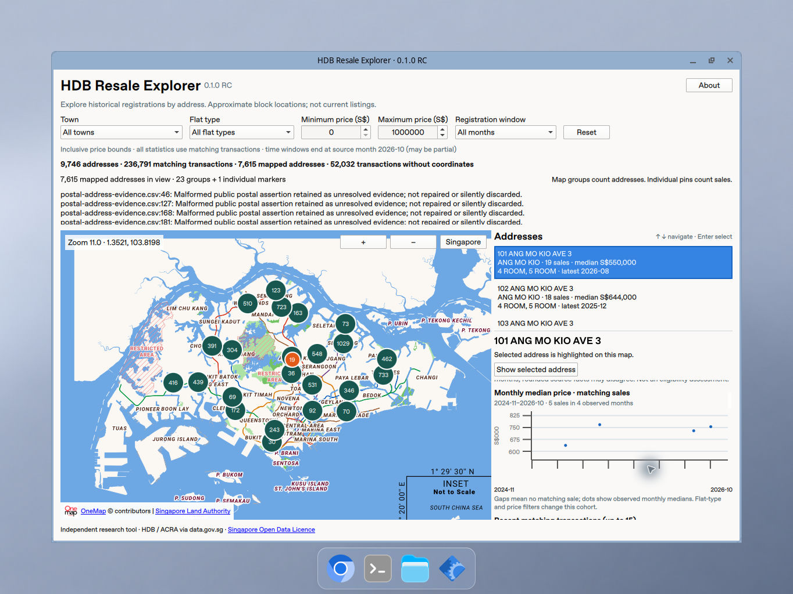

# HDB Resale Explorer

An independent C# / Qt desktop app for exploring Singapore HDB resale registrations by address. It reads the **HDB Resale Explorer API**, the same Worker API the [web app](https://github.com/shenghaoc/hdb-resale-visualizer) uses, so both apps show the same addresses and figures. It is not affiliated with HDB, SLA or the Singapore Government.



The capture predates the API client: it shows the 0.1.0 release candidate on a locally prepared corpus, recorded in its [verification screenshots and checkpoints](docs/product-rc/README.md#physical-linux-release-check).

## Find an address worth investigating

- Combine town, flat type and minimum/maximum median filters. With a flat type selected, prices, counts and latest sales are that type's.
- Optionally keep only addresses with a registration in the latest 12 or 24 source months. Windows end at the dataset's latest month, not the computer clock; that final month may be partial.
- Browse addresses, lowest median first: sales count, latest registration month, median price and flat types.
- Select the same address from the list or map. Review its 20 newest registrations with source storey, area, model, lease commencement and remaining-lease text, its interquartile price range, nearest MRT and approximate location.
- Inspect a compact monthly-median price trend for the latest 24 source months. Dots mean observed months; gaps mean no sale.
- Navigate the list by keyboard, use native controls, and see the dataset's publication time and coverage in the About dialog.

Figures are the API's: each address's statistics cover the dataset's latest 24 source months, or all its recorded months when it had no sale in them. They describe registered resales, not listings or asking prices. The default maximum is S$1,000,000. Reset restores all towns/types, minimum zero, that maximum and any registration month. If the minimum exceeds the maximum, the result is empty until corrected. [How each workflow maps onto the API](docs/worker-api.md).

## Map and selection

Qt Location displays OneMap raster tiles with visible attribution. C# keeps every filtered address and projects only the viewport's: stable grid groups at low zoom and individual addresses at zoom 15+. Group numbers count addresses; individual pin numbers count sales. A group click changes the camera; it never creates a pretend address.

The selected address survives panning offscreen, with a notice and “Show selected address”, and survives filter changes while it still matches; it clears when it no longer does. List, map and details share one C# selection.

No database, account, runtime geocoding or AI dependency is required. The app needs network access for the API and for uncached map tiles. The small Qt Graphs 2D chart plots the API's monthly medians without a custom chart framework.

## Run from source

Pinned toolchain: .NET SDK **10.0.401**, runtime **10.0.12**, Qt **6.12.0**, Qt Bridge **0.4.0-beta** on Linux x64 and **0.4.0.22-beta** on macOS. Do not mix Qt installations: the Bridge uses Qt private headers.

Follow [Linux setup](docs/linux.md) or the [historical macOS provisioning record](docs/milestone-10-history.md). Set `QtDir` to the matching Qt installation and put .NET, CMake and Ninja on `PATH`. Alongside Location/Positioning/ShaderTools, M11 requires the matching official Qt Graphs and Qt Quick 3D modules (the latter is a runtime dependency of the Graphs build, even for this 2D view).

```sh
dotnet build -c Debug -m:1
dotnet test -c Debug --no-build
dotnet build -c Release -m:1
dotnet test -c Release --no-build
dotnet run --project src/HdbResale.App -c Release --no-build
```

The app reads the production API by default. Set `HDB_API_BASE_URL` to use another deployment, such as a Workers preview, or the recorded responses in `tests/fixtures/worker-api` without a network:

```sh
python3 tools/api_fixture_server.py --port 8787
HDB_API_BASE_URL=http://127.0.0.1:8787/ dotnet run --project src/HdbResale.App -c Release --no-build
```

Plain `http` is accepted only for a loopback test server. With `HDB_PACKAGE_SMOKE=1` the app loads the data, selects the first address, prints readiness markers and exits.

The `--coverage`, `--onemap-*`, `--scale`, `--import-digest` and `--startup-profile` modes remain offline research tools over a prepared source directory ([source preparation](data/README.md), [ordered offline imports](docs/ordered-source-import.md)); the window never reads them.

## Data interpretation

- Source months are registration months. Floor area is approximate and may include purchased recess areas or improvements.
- Medians, counts and floor-area ranges are the API's, over the latest 24 source months, or all recorded months when an address had none. With a flat type selected, that type's figures are used when the API publishes them, and the address's otherwise.
- Remaining lease follows the web app: what remains of a 99-year lease from the commencement year, in the current calendar year. Each registration also shows the remaining lease recorded at its resale application.
- Coordinates are approximate HDB block points, never exact flats. Nothing here is an eligibility, valuation or affordability assessment.

See the [official HDB dataset](https://data.gov.sg/datasets/d_8b84c4ee58e3cfc0ece0d773c8ca6abc/view) and the [Singapore Open Data Licence](https://data.gov.sg/open-data-licence).

## Architecture

`HdbResale.Domain` owns the Worker API client (`WorkerApi.cs`: validated records and errors) and the web app's semantics for the filters this app offers (`AddressExplorer.cs`), checked against the web app's golden fixtures. `HdbResale.App` runs API requests off the UI thread and applies their results on it, and exposes Qt models, an incremental viewport/grid map projection and native QML controls. Reentrant UI mutations drain through one FIFO queue. The parentless Bridge map wrapper retains its explicit QML lifetime anchor.

This app and the web app are independent implementations of one product over one API: no shared framework, no snapshot hosting and no separate backend. Shortlists and any other private writes stay behind the Worker.

## Verification

Debug and Release build and pass **278 C# tests each**, including the API client against recorded responses and the web app's golden filter fixtures; all **54 Python tests** and the native tile-monitor CTests pass. [Native checks](docs/worker-api.md#native-checks) drive the real app:
- a sixteen-step buyer acceptance gate over the recorded API, with fixed expectations for every step;
- smoke runs against the production API, the recorded responses, an unreachable API and high-zoom markers.

On macOS arm64 both configurations pass all of them, run unattended on Qt's offscreen platform. This is functional verification only. Visual review and native visual/input acceptance (real palette, contrast, controls and appearance) are separate, scheduled native runs. The CSV-based native gates of the offline 0.1.0 release candidate were retired with that data path.

## Platforms, licence and RC limits

Linux x64 has the complete M11 verification record of the offline 0.1.0 release candidate, which predates the API client. The Linux package now bundles no data, and its launch check reads the recorded API by default. From macOS this was checked as packaging/build-logic verification only (unit tests of staging and the launch check). It is not native Linux installation acceptance; the package has not been rebuilt and launched on Linux since that change, and native RPM/DEB/runtime acceptance is planned for Fedora. Current macOS arm64 builds, unit tests and the available strict native gates pass; expanded-data and physical acceptance remain pending. See the [current Mac checkpoint and blockers](docs/product-rc/macos-verification.md). Windows has not been built or UI-tested. No installer publication, signing, notarization, tag, push or official release is included.

Original application code is licensed **GPL-3.0-or-later**, as chosen by its owner. See [LICENSE](LICENSE), scoped [SPDX metadata](REUSE.toml) and [third-party notices](THIRD_PARTY_NOTICES.md). Qt Graphs and its required Qt Quick 3D libraries retain their GPL-3.0-only terms; Qt/Bridge, other bundled dependencies, public data and OneMap keep their own terms. See the [local Linux RC package and licensing checklist](docs/product-rc/licensing-packaging.md). The documented local Linux directory/tar recipe includes a fresh-state, unrelated-working-directory real-X11 launch check. It is a bounded test artifact, not a claim of general distribution readiness. The last private tar, the offline RC with its six-row CSV, passed a fresh-state, relocated launch check including the real chart and bundled runtime mappings ([package hashes and verified scope](docs/product-rc/package-verification.json)). No AppImage, DMG or Windows installer is produced, and no remote package CI is claimed.

Detailed milestone evidence stays under `docs/`: [M10 architecture and measurements](docs/large-map/README.md), [M9 coverage](docs/address-coverage/README.md), and [earlier development history](docs/milestone-10-history.md).
